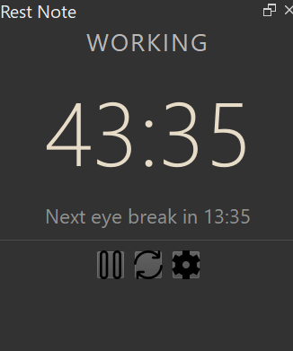
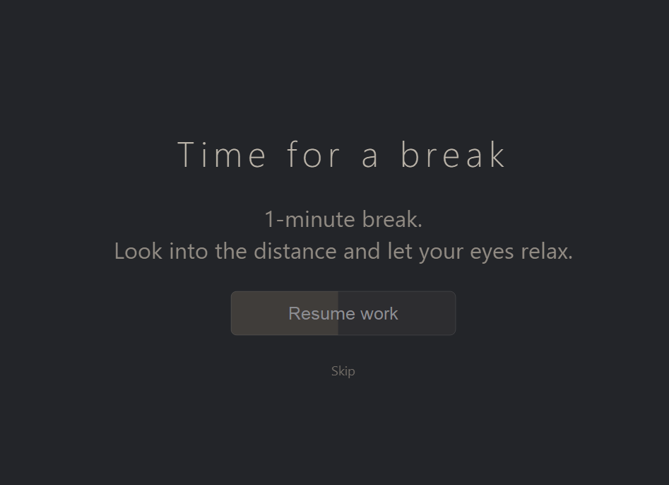
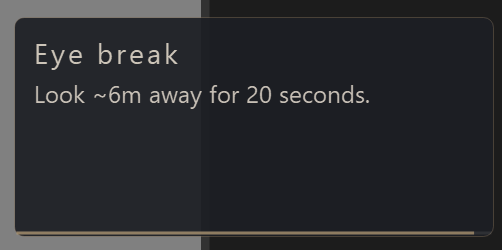
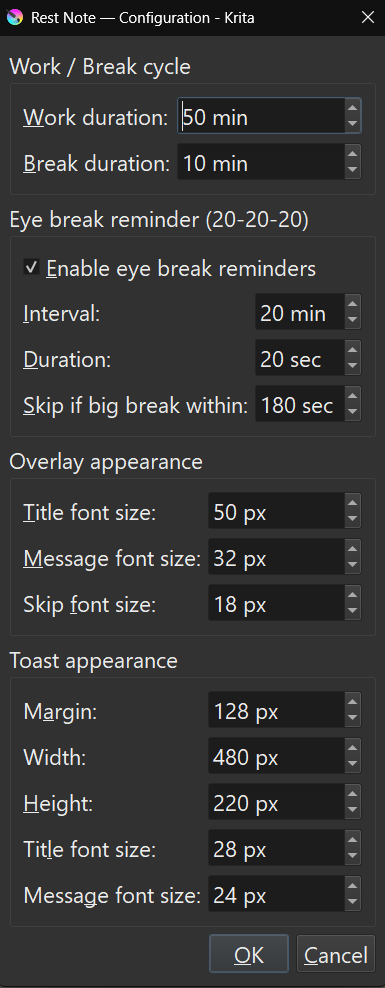

# Rest Note

A Krita plugin that enforces healthy work-break cycles to protect your eyes and reduce fatigue during long drawing sessions.

Rest Note combines two complementary timers: a configurable work cycle that triggers a fullscreen break, and an optional **eye break reminder** that surfaces a soft toast in the corner of your screen. 

---

## Features

- **Scheduled work breaks** — A configurable cycle (default: 50 minutes work / 10 minutes break) that takes over your screen with a slow-fading overlay. The "Resume work" button only becomes clickable after the full break duration has elapsed.
- **20-20-20 eye break reminders** — Optional periodic micro-breaks following the well-known [20-20-20 rule](https://www.aao.org/eye-health/tips-prevention/computer-usage): every 20 minutes, look ~6 meters away for 20 seconds. A small toast appears in the corner of the screen without blocking input.
- **Responsive docker UI** — Time and status labels scale dynamically with the docker widget size.
- **Pause / Reset / Config controls** — Standard timer controls directly in the docker.
- **Persistent settings** — Configuration is stored in `config/main.json` inside the plugin directory.

---

## Screenshots

**Docker panel** — Compact display showing the current state, time until the next break, and controls.

**Break overlay** — A fullscreen overlay that fades in over 30 seconds, with a calming color palette and a progress button that becomes clickable only after the full break duration.
However, you can resume it immediately by click the skip button.

**Eye break toast** — A small unobtrusive notification in the corner of the screen, with a thin progress bar that drains as the 20 seconds pass.

---

## Usage

Once enabled, the timer starts automatically when Krita launches. The docker shows your current state at all times.

### Docker controls

| Button | Action |
|---|---|
| **Pause / Resume** | Freezes both timers. Click again to resume. |
| **Reset** | Resets both timers and cancels any active overlay or toast. |
| **Config** | Opens the configuration dialog. |

### States

| State | Meaning |
|---|---|
| `WORKING` | Normal countdown to the next big break. |
| `PAUSED` | Both timers are frozen. |
| `ON BREAK` | Fullscreen break overlay is active. |
| `EYE BREAK` | A 20-second eye break toast is currently shown. |

---

## Configuration

Click the **Config** button to open the settings dialog. All settings are saved immediately to `config/main.json`.